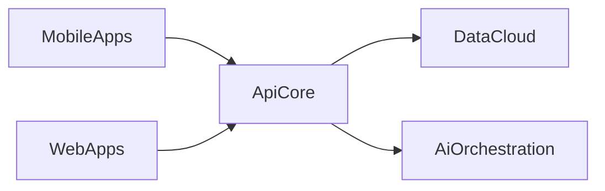

# Hero Architecture Flow Spec

This document defines the shared visual contract for the home hero architecture flow, plus a ready-to-use Gemini 3.1 Pro prompt pack for regenerating the SVGs externally.

## Goal

Replace the abstract particle network with a product-oriented system diagram that communicates:

- mobile apps
- web apps
- API/backend architecture
- cloud/data infrastructure
- AI workflows

The final composition should feel premium, restrained, and editorial, not like a generic SaaS dashboard or an "AI network" landing page.

## Asset Inventory

Create or maintain these files under `public/hero/architecture-flow/`:

- `mobile-app.svg`
- `web-app.svg`
- `api-core.svg`
- `data-cloud.svg`
- `ai-orchestration.svg`
- `flow-connectors.svg`

## Shared Visual Contract

### Artboards

- Module SVG artboard: `320 x 220`
- Connector SVG artboard: `920 x 620`
- Transparent background for every file
- Keep all important details inside a `24px` safe area

### Style

- Minimal vector illustration
- Clean geometric shapes
- Rounded corners
- Thin-to-medium strokes
- Soft inner detail, no visual clutter
- No text labels baked into the SVGs
- No shadows extending beyond the artboard
- No photorealism, textures, or noisy gradients

### Palette

Use this palette consistently:

- `#E2E8F0` for bright line work
- `#94A3B8` for secondary line work
- `#3B82F6` for primary accents
- `#60A5FA` for glow accents
- `#0F172A` and `#111827` for dark insets and device surfaces
- `#1E293B` for muted dark structure

Small opacity variations are fine, but the palette should stay tight.

### Geometry

- Outer corner radius: `20-28`
- Inner card radius: `12-18`
- Main stroke width: `2`
- Secondary stroke width: `1.5`
- Keep icon alignment deliberate and grid-based

### Motion Assumptions

The SVGs should be designed for light motion added in React:

- slow float
- subtle fade in
- soft pulse on highlighted nodes

Do not draw motion blur, speed trails, or exaggerated glow effects into the SVGs themselves.

## Composition Map

The hero layout uses five modules around a central API node:



Recommended visual placement inside the hero:

- `Mobile` near top-left
- `Web` near bottom-left
- `API` centered and slightly dominant
- `AI` near top-right
- `Data/Cloud` near bottom-right
- `flow-connectors.svg` spans the whole composition behind the cards

## Shared Gemini Prompt Prefix

Use this prefix for every prompt below:

```text
Create a standalone SVG only. Do not wrap the answer in markdown. Use a transparent background and preserve the exact requested viewBox. Make the illustration minimal, premium, geometric, and clean. The visual style should match a modern software engineer portfolio with glassmorphism-inspired UI, blue accent highlights, dark inset surfaces, slate neutrals, and subtle depth. Avoid generic AI particle networks, blobs, neon overload, busy dashboards, text labels, and clip-art styling. Use rounded shapes, crisp strokes, and a tight palette of #E2E8F0, #94A3B8, #3B82F6, #60A5FA, #0F172A, #111827, and #1E293B.
```

## Per-Asset Prompts

### `mobile-app.svg`

```text
Create a 320 by 220 SVG illustrating a premium mobile app module on a transparent background. Show a sleek phone frame with a dark inset screen, rounded corners, a small top speaker/notch area, and 3 to 4 simplified UI blocks inside the screen. Add one or two blue accent elements suggesting activity or navigation. Keep the drawing minimal and elegant, centered, and balanced for placement inside a glass card. No text, no logos, no background panel, no shadow outside the artboard.
```

### `web-app.svg`

```text
Create a 320 by 220 SVG illustrating a premium web app module on a transparent background. Show a rounded browser window with a top bar, a slim left sidebar, and a few clean content blocks or chart cards in the main area. Use dark inset surfaces with light strokes and a few restrained blue highlights. Keep the illustration minimal, editorial, geometric, and uncluttered. No text, no logos, no background panel, no shadow outside the artboard.
```

### `api-core.svg`

```text
Create a 320 by 220 SVG illustrating the central API and backend module on a transparent background. Show a strong central service object using either layered server blocks, a rounded hexagon with internal routing lines, or a compact service hub, with 4 connection nodes positioned to imply incoming and outgoing flow. Make this asset the most structurally important of the set. Use clean blue routing accents, light strokes, dark inset geometry, and subtle status indicators. No text, no logos, no background panel, no shadow outside the artboard.
```

### `data-cloud.svg`

```text
Create a 320 by 220 SVG illustrating a data and cloud infrastructure module on a transparent background. Combine a simplified cloud shape with a database cylinder or storage stack, plus one or two small file or sync details. Use the same premium geometric vector style, with dark inset elements, light line work, and restrained blue highlights. Keep it balanced and uncluttered. No text, no logos, no background panel, no shadow outside the artboard.
```

### `ai-orchestration.svg`

```text
Create a 320 by 220 SVG illustrating an AI workflow module on a transparent background. Show a clean central spark or star-like intelligence icon combined with a compact chip, chat bubble, or branching workflow nodes. Make it look product-oriented and trustworthy rather than sci-fi. Use the same tight palette, rounded geometry, light strokes, dark inset details, and blue highlights. No text, no logos, no background panel, no shadow outside the artboard.
```

### `flow-connectors.svg`

```text
Create a 920 by 620 SVG for a hero background connector layer on a transparent background. Draw elegant curved connector paths linking module positions arranged around a central hub: top-left and bottom-left into center, then center out to top-right and bottom-right. Add small node dots and subtle pulse points near key intersections. Keep all paths thin, clean, and understated with blue and slate tones. Do not include any cards, icons, text, or decorative particle field. This must feel like a refined systems diagram, not an AI network.
```

## Implementation Notes

- The React component should provide the glass cards, panel chrome, labels, and motion.
- The raw SVGs should stay illustration-only so they can be swapped later with Gemini-generated versions.
- The connector layer should sit behind the cards and remain subtle.
- The central `API` card should be slightly larger or more visually prominent than the side cards.

## Swap Procedure

If you regenerate the SVGs with Gemini 3.1 Pro later:

1. Keep the same filenames.
2. Preserve the exact viewBox sizes.
3. Keep transparent backgrounds.
4. Do not add text to the assets.
5. Check that the new SVGs still read clearly on dark inset panels.
